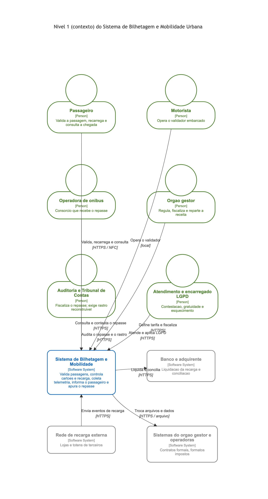
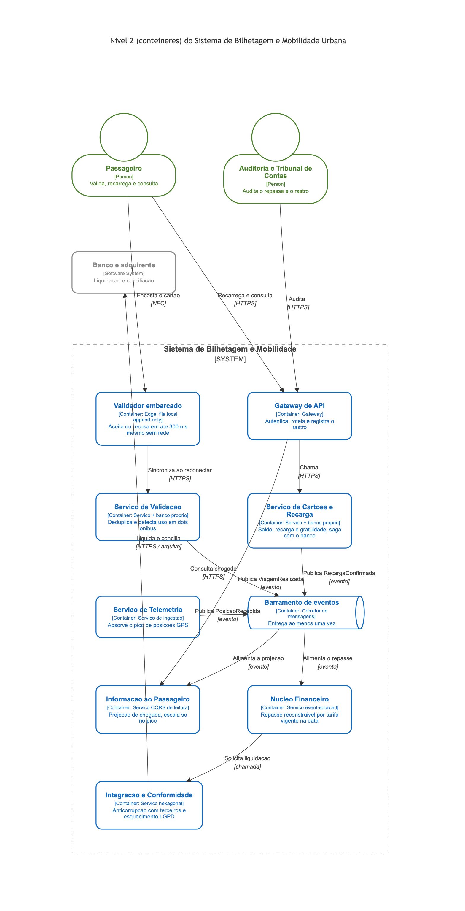
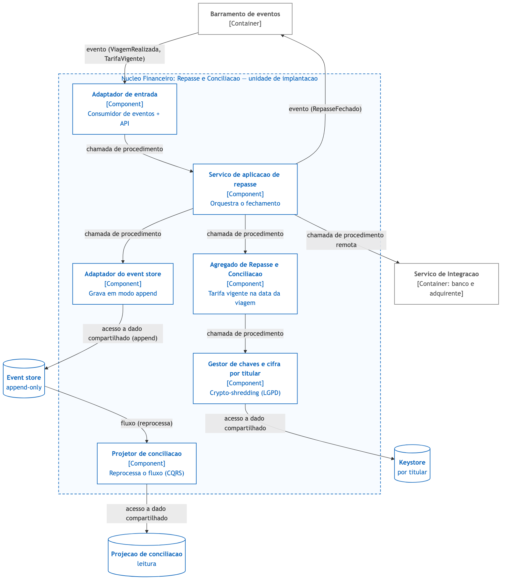

# Documento de arquitetura — Sistema de Bilhetagem e Mobilidade Urbana

**Disciplina:** Padrões e Arquitetura de Software · PUC-Campinas · 2026-2
**Grupo 06 — Caso Ônibus (bilhetagem e mobilidade urbana) + Envelope E (operação sob fiscalização)**
**Entrega 2 — Documento de arquitetura**

> Referência do vocabulário e das convenções: ABREU, Douglas H. S. *Estilos Arquiteturais de Software: guia de consulta*. As citações no formato "seção X.Y" e "capítulo N" remetem a esse livro. As decisões são do caso e do envelope; o livro sustenta o argumento, não substitui a escolha (regra geral da atividade).

---

## 1. Identificação e escopo

O órgão gestor do transporte vai substituir o sistema de bilhetagem eletrônica, hoje um monolito fechado de fornecedor. O novo sistema cobre validação da passagem no ônibus, cartões e recarga, telemetria da frota, informação ao passageiro e repasse financeiro entre operadoras e prefeitura.

O **envelope E** define quem constrói e opera: operação sob fiscalização de órgão regulador, em nuvem pública, com **trilha de auditoria completa** (tudo reconstruível) e **LGPD com direito ao esquecimento**. A equipe tem **15 desenvolvedores e 1 responsável por conformidade**. A pergunta que o envelope obriga a responder é: *como guardar tudo para sempre e ainda assim apagar o que a lei manda apagar?*

Esse envelope muda o que é uma boa decisão. A mesma bilhetagem, sob o envelope A (startup, entregar rápido e barato), começaria como monolito modular e adiaria o event sourcing; sob o envelope E, a reconstrutibilidade e a auditoria financeira empurram parte do sistema para event sourcing desde o início, e a tensão com a LGPD vira a decisão mais arriscada do projeto (seção 9 deste documento).

### 1.1 Convenções de notação

O estilo visual das três figuras é baseado nos diagramas oficiais do **[c4model.com](https://c4model.com)**: caixas brancas com borda e texto coloridos, pessoa com ícone de cabeça, cilindro para armazenamento, sistemas externos em cinza, e o tipo do elemento entre colchetes (`[Person]`, `[Container: tecnologia]`, `[Component]`).

- Os **níveis 1 e 2** usam a sintaxe C4 do Mermaid e seguem as convenções do capítulo 3: tecnologia entre colchetes; no nível 2 o rótulo da seta traz a ação e o protocolo; a caixa tracejada é a fronteira do sistema (não uma unidade de implantação).
- O **nível 3** segue a convenção de estrutura da seção 3.6, desenhada em diagrama de fluxo (recurso que o próprio livro usa e sanciona para o nível 3, seções 3.6 e B.4): caixa é componente, cilindro é armazenamento, **seta rotulada é conector, com o tipo declarado** (chamada de procedimento, evento, fluxo, acesso a dado compartilhado), e o agrupamento tracejado é a unidade de implantação.

As três figuras têm fonte em Mermaid (`.mmd`) versionada ao lado do `.png` renderizado.

---

## 2. Visão geral: a composição de estilos e suas fronteiras

A arquitetura é **híbrida e composta**, como a atividade permite e espera. O ADR de composição é o [ADR 0001](adr/0001-compor-microsservicos-por-subdominio-com-espinha-de-eventos.md); ele é o primeiro que um novo integrante deve ler (seção 4.6). Os estilos e **onde cada fronteira começa e termina**:

| Estilo | Onde vale (fronteira) | Onde termina | ADR |
|---|---|---|---|
| **Microsserviços** (cap. 9) | Estrutura geral: um serviço por subdomínio com atributos divergentes (validação, cartões, telemetria, informação, financeiro, integração/conformidade) | Não desce ao interior do serviço nem aos subdomínios de baixo volume, mantidos como módulos | 0001 |
| **Orientada a eventos** (cap. 11) | Conector padrão *entre* serviços: barramento com entrega ao menos uma vez | Não substitui a chamada síncrona quando a resposta é necessária na hora (ex.: recarga na tela) | 0001 |
| **Hexagonal** (cap. 7) | Interior de cada serviço: domínio no centro, portas e adaptadores para banco, mensageria e terceiros | Não muda processo nem rede; é organização de código (crítica de escopo, seção 7.6.1) | 0001, 0003 |
| **Event Sourcing** (cap. 15) | Somente o Núcleo Financeiro (repasse e conciliação): fonte de verdade append-only | Não entra em cadastro de cartões nem em catálogo, onde o estado atual basta e a LGPD aperta | 0002 |
| **CQRS** (cap. 14) | Lado de leitura do financeiro (projeções de conciliação) e informação ao passageiro | Não vale onde a leitura precisa refletir a escrita no mesmo instante (ex.: saldo para autorizar) | 0002 |

A régua que separa os quanta é o **acoplamento dinâmico** (seção 2.5): dois serviços que só se falam por evento assíncrono continuam sendo dois quanta e respondem sozinhos quando o vizinho cai. É essa propriedade que faz a telemetria poder tombar sem levar a validação junto.

A figura de contexto mostra o sistema como uma caixa e seus interlocutores; a de contêineres abre a caixa; a de componentes desce ao contêiner mais importante.

*Figura 1: nível 1 (contexto). O sistema cercado por seis papéis de usuário e três sistemas externos. A auditoria e o encarregado LGPD aparecem como partes interessadas de primeira classe, porque o envelope E os coloca no centro.*

---

## 3. Nível 2 — contêineres

*Figura 2: nível 2 (contêineres). Cada seta traz a ação e o protocolo; a caixa tracejada é a fronteira do sistema, não uma unidade de implantação (os contêineres dentro dela se implantam separadamente).*

Os contêineres e seu papel:

- **Validador embarcado** — unidade de implantação na borda (edge), com fila local append-only. Decide offline em até 300 ms e sincroniza ao reconectar ([ADR 0006](adr/0006-validar-offline-no-embarcado-e-deduplicar-a-passagem-no-servidor.md)).
- **Gateway de API** — entrada única: autentica, limita, roteia e registra o rastro de acesso ([ADR 0004](adr/0004-operar-em-nuvem-com-trilha-de-auditoria-e-observabilidade-obrigatorias.md)).
- **Serviço de Validação** — deduplica passagens e detecta uso em dois ônibus, reconstruindo o uso a partir do fluxo.
- **Serviço de Cartões e Recarga** — saldo, recarga, bloqueio e gratuidade; banco próprio; saga com o banco.
- **Serviço de Telemetria** — ingestão de fluxo; absorve o pico de posições GPS e o amortece no barramento.
- **Informação ao Passageiro** — projeção de leitura (CQRS); escala réplicas no pico do rush e recua fora dele.
- **Núcleo Financeiro** — repasse e conciliação event-sourced; **contêiner mais importante** e detalhado no nível 3.
- **Integração e Conformidade** — serviço hexagonal com adaptadores anticorrupção para terceiros e a execução do esquecimento LGPD; abriga os módulos de atendimento e gratuidade (baixo volume).
- **Barramento de eventos** — corretor de mensagens; espinha dorsal assíncrona e origem da trilha de auditoria.

Cada serviço é dono exclusivo do próprio banco (database per service, seção 9.2); nenhum lê a tabela do outro, nem para relatório ([ADR 0002](adr/0002-dar-a-cada-servico-o-proprio-banco-e-usar-event-sourcing-no-financeiro.md)).

---

## 4. Nível 3 — componentes do Núcleo Financeiro

O Núcleo Financeiro é o contêiner mais importante porque nele se encontram as duas exigências que dominam o envelope E: reconstruir tudo (auditoria) e apagar o que a LGPD manda (esquecimento). É onde vivem os estilos event sourcing e CQRS e a decisão mais arriscada do projeto.

*Figura 3: nível 3 (componentes) do Núcleo Financeiro. A caixa tracejada é a unidade de implantação; os cilindros são armazenamento; cada seta traz o tipo do conector.*

- **Adaptador de entrada** — consome os eventos `ViagemRealizada` e `TarifaVigente` do barramento (conector: **evento**) e expõe a API de fechamento.
- **Serviço de aplicação de repasse** — orquestra o comando; chama o domínio, o adaptador do event store e o gestor de chaves (conector: **chamada de procedimento**).
- **Agregado de Repasse e Conciliação** — regra de negócio: aplica a tarifa **vigente na data de cada viagem**, não a tarifa de hoje.
- **Gestor de chaves e cifra por titular** — cifra os campos pessoais com chave por titular e grava/consulta o keystore (conector: **acesso a dado compartilhado**). É o mecanismo do [ADR 0005](adr/0005-conciliar-auditoria-imutavel-e-esquecimento-lgpd-por-crypto-shredding.md).
- **Adaptador do event store** — grava os eventos em modo append (conector: **acesso a dado compartilhado**).
- **Projetor de conciliação** — reprocessa o fluxo (conector: **fluxo**) e mantém a projeção de leitura (CQRS).

Ao fechar o mês, o serviço publica `RepasseFechado` no barramento (evento) e solicita a liquidação ao Serviço de Integração (chamada de procedimento remota).

---

## 5. Dados, propriedade e consistência

- **Propriedade:** cada serviço é dono do próprio dado; o acesso externo passa pela interface publicada (seção 9.2). O histórico de viagens identificado é dado pessoal sob a LGPD e recebe tratamento especial (seção 8 e ADR 0005).
- **Fonte de verdade do financeiro:** o event store append-only. O estado atual é uma projeção derivada, reconstruível por reprodução; snapshots periódicos evitam reprocessar o fluxo inteiro (seção 15.7).
- **Consistência entre serviços:** não há transação distribuída (o commit em duas fases é descartado, seção 9.2). Processos que cruzam serviços — recarregar, debitar, liquidar — usam **saga** com compensação e passos **idempotentes**, operando em **consistência eventual**. Estornar compensa cobrar; liberar compensa reservar.
- **Consistência de leitura:** as projeções CQRS têm atraso; o atraso vira requisito medido e tratado como incidente quando violado (seção 14.7). Onde a leitura precisa refletir a escrita na hora — o saldo usado para autorizar o próximo uso — não se usa a projeção, e sim o dono do dado.

---

## 6. Atributos de qualidade priorizados e trade-offs

Seguindo a primeira lei da arquitetura — tudo é trade-off (seção 2.4) — a ordem de prioridade sob o envelope E é: **segurança/auditabilidade e disponibilidade** acima de **custo**, e **escalabilidade seletiva** acima de **simplicidade operacional**.

| Atributo (seção 2.3) | Como a arquitetura o favorece | O que se paga em troca |
|---|---|---|
| Segurança / auditabilidade | Trilha imutável por eventos; event sourcing no financeiro; crypto-shredding | Gestão de chaves crítica; armazenamento que cresce sem parar |
| Disponibilidade | Quanta isolados por evento; degradação graciosa; disjuntor com terceiros | Consistência eventual; sagas e idempotência |
| Escalabilidade | Telemetria e informação escalam sozinhas; barramento amortece picos | Observabilidade distribuída obrigatória |
| Modificabilidade | Hexagonal por serviço; banco por serviço | Contrato versionado entre serviços |
| Testabilidade | Domínio isolado de infraestrutura (portas e adaptadores) | Testes de contrato e de projeção adicionais |
| Custo | Escala e paga por serviço, conforme a carga real | Custo operacional multiplicado pelo número de serviços |

**A tensão honesta.** Microsserviços "quando evitar" (seção 9.6) e a recomendação de Fowler ("monolito primeiro") pesam contra uma equipe de 15 pessoas. Por isso a composição **não pulveriza**: mantém poucos serviços, extrai só os subdomínios cujos atributos divergem de verdade (validador offline, telemetria em pico, financeiro auditável) e conserva atendimento, gratuidade e conformidade como módulos de um único serviço. É a aplicação literal do conselho de "boa modularidade interna" onde a distribuição não se paga.

---

## 7. As cinco respostas obrigatórias do caso

Cada resposta traz o mecanismo passo a passo, o que aconteceria se a decisão falhasse, e os ADRs e diagramas que a sustentam.

### 7.1 Como o validador aceita a passagem sem rede, e como o sistema descobre depois que a mesma passagem foi usada em dois ônibus?

**Resposta curta.** O validador decide sozinho, offline, e a duplicata é descoberta depois, no servidor, quando as validações são consolidadas.

**Como funciona.**
1. Cada validador guarda uma **lista local** de cartões e regras (bloqueios, gratuidades, limite de risco offline), sincronizada sempre que há rede.
2. No embarque, o validador consulta essa lista **em memória** e aceita ou recusa em **até 300 ms**, sem tocar a rede — por isso a resposta não depende do 4G.
3. Cada validação vira um registro numa **fila local append-only assinada**, com um **identificador único** = (validador, cartão, viagem, carimbo de tempo).
4. Ao reconectar (em minutos ou em até 4 horas), o validador envia a fila acumulada ao **Serviço de Validação** com **entrega ao menos uma vez**.
5. O serviço é **idempotente** por aquele identificador (mensagem repetida não conta duas vezes) e **reconstrói o uso do cartão a partir do fluxo de eventos**.
6. Se o mesmo cartão e a mesma viagem chegam de **dois validadores diferentes**, a colisão é detectada na consolidação: o segundo uso é marcado como suspeita, com os dois fatos preservados em ordem como prova — nunca sobrescritos.

**Se desse errado.** Sem o identificador único e a idempotência, uma sincronização repetida cobraria a passagem duas vezes; sem a fila assinada, não haveria prova do uso concorrente. Por isso a dedução fica no servidor, e não no ônibus, onde não há como consultar os outros 1.199 validadores offline.

→ Sustentação: [ADR 0006](adr/0006-validar-offline-no-embarcado-e-deduplicar-a-passagem-no-servidor.md); apoio em [ADR 0002](adr/0002-dar-a-cada-servico-o-proprio-banco-e-usar-event-sourcing-no-financeiro.md) (fluxo de eventos). Figura 2 (Validador embarcado → Serviço de Validação → Barramento).

### 7.2 Como o saldo do cartão fica consistente entre recarga no aplicativo e uso no ônibus, com atraso de sincronização?

**Resposta curta.** O saldo tem um dono único (o Serviço de Cartões e Recarga), e recarga e débito são reconciliados por saga idempotente em consistência eventual.

**Como funciona.**
1. O saldo vive **só** no Serviço de Cartões e Recarga (banco por serviço, seção 9.2); nenhum outro serviço escreve nele.
2. A **recarga** (app, loja, totem) e o **débito** (ônibus, vindo da validação) chegam como **fatos distintos**, cada um idempotente por identificador.
3. Uma **saga** aplica esses fatos em ordem e compensa quando um passo falha (estornar compensa cobrar); o saldo converge por **consistência eventual**.
4. A recarga em loja/totem entra pelo **adaptador anticorrupção** e só é dada como boa quando **conciliada contra o retorno do banco**, o que sustenta "fraude de recarga zero".
5. Onde a leitura precisa ser exata na hora — o saldo usado para **autorizar** o próximo uso — consulta-se o **dono do dado**, nunca uma projeção atrasada.

**Se desse errado.** Se dois serviços escrevessem o saldo, ou se a recarga fosse confirmada antes da conciliação bancária, abririam-se brechas de fraude e divergência; a saga idempotente evita cobrar/estornar em duplicidade quando as mensagens se repetem.

→ Sustentação: [ADR 0001](adr/0001-compor-microsservicos-por-subdominio-com-espinha-de-eventos.md), [ADR 0002](adr/0002-dar-a-cada-servico-o-proprio-banco-e-usar-event-sourcing-no-financeiro.md), [ADR 0003](adr/0003-isolar-terceiros-atras-de-adaptadores-anticorrupcao-assincronos.md). Figura 2 (Cartões e Recarga ↔ Barramento ↔ Integração/Banco).

### 7.3 Como a telemetria escala no pico sem derrubar o restante do sistema?

**Resposta curta.** A telemetria é um serviço isolado que só publica eventos num barramento que amortece o pico; o resto do sistema não sente a enxurrada.

**Como funciona.**
1. A telemetria é um **quantum próprio**: um Serviço de Telemetria que recebe as posições GPS (80/s em média, 5× no pico) e **publica `PosicaoRecebida`** no barramento — e nada mais.
2. O **barramento funciona como amortecedor**: os consumidores (informação ao passageiro, painéis) absorvem o pico **com atraso**, sem bloquear a ingestão (seção 11.5).
3. Como o acoplamento é **só por evento assíncrono**, uma enxurrada de posições **não propaga pressão** para a validação nem para o repasse — eles continuam de pé se a telemetria congestionar (seção 2.5).
4. O serviço de telemetria **escala sozinho** (mais réplicas) no pico e **recua** fora dele, sem mexer nos outros serviços (ADR 0004).

**Se desse errado.** Se a telemetria chamasse os outros serviços de forma síncrona, ou compartilhasse banco com eles, o pico viraria indisponibilidade geral — exatamente o "monolito distribuído" que o ADR 0001 evita.

→ Sustentação: [ADR 0001](adr/0001-compor-microsservicos-por-subdominio-com-espinha-de-eventos.md), [ADR 0004](adr/0004-operar-em-nuvem-com-trilha-de-auditoria-e-observabilidade-obrigatorias.md). Figura 2 (Telemetria → Barramento; Barramento → Informação ao Passageiro).

### 7.4 Como o repasse mensal é recalculado se uma regra de tarifa mudou no meio do mês?

**Resposta curta.** O repasse não é um número guardado: é reprocessado a partir do histórico de viagens, aplicando a tarifa vigente na data de cada viagem.

**Como funciona.**
1. O Núcleo Financeiro é **event-sourced**: a fonte de verdade é o **fluxo append-only** de `ViagemRealizada` e `TarifaVigente`, não uma tabela de totais sobrescrita.
2. O **Agregado de Repasse** aplica, para cada viagem, a **tarifa vigente na data daquela viagem** — se a tarifa mudou no dia 15, as viagens do dia 10 seguem com a tarifa antiga e as do dia 20 com a nova.
3. Recalcular o mês é **reprocessar o fluxo** pelo Projetor de conciliação e gerar a projeção de leitura (CQRS); uma pergunta nova da auditoria vira uma **nova projeção**, sem perder as anteriores.
4. Como nada é sobrescrito, é sempre possível **reconstruir** o fechamento de qualquer mês para responder a contestação (até 30 dias) e à fiscalização do Tribunal de Contas.

**Se desse errado.** Com estado sobrescrito, uma mudança de tarifa apagaria a base de cálculo anterior e o repasse antigo não poderia ser reproduzido — o que a auditoria do envelope E não aceita.

→ Sustentação: [ADR 0002](adr/0002-dar-a-cada-servico-o-proprio-banco-e-usar-event-sourcing-no-financeiro.md). Figura 3 (Adaptador de entrada → Agregado de Repasse → Projetor de conciliação → Projeção de leitura).

### 7.5 Como o histórico de viagens de uma pessoa é apagado quando ela pede, sem quebrar a conciliação financeira?

**Resposta curta.** O dado pessoal de cada evento é cifrado com uma chave por titular; apagar é destruir a chave (crypto-shredding), o que torna o pessoal irrecuperável sem tocar nos totais financeiros.

**Como funciona.**
1. Em cada evento, separam-se dois blocos: o **pessoal** (quem viajou, quando, de onde) e o **financeiro** (linha, operadora, tarifa, valor).
2. O bloco pessoal é **cifrado com uma chave exclusiva do titular**, guardada num **keystore fora do event store**; o bloco financeiro fica **em claro e não identifica a pessoa**.
3. Ao receber um **pedido de esquecimento**, o sistema **destrói a chave** daquele titular. Sem a chave, o conteúdo pessoal vira ruído irrecuperável — mas o **evento, sua ordem e os totais de conciliação permanecem íntegros**.
4. Dentro do fluxo, exclusão nunca é apagar um fato: registra-se um **evento de reversão**; o histórico de que houve esquecimento também fica auditável.
5. Resultado: a **mesma base** atende a auditoria (reconstrói tudo) e a LGPD (esquece o que a lei manda) — a resposta direta à pergunta que domina o envelope E.

**Se desse errado.** Apagar fisicamente os eventos quebraria a cadeia de versões e o fechamento financeiro; manter o pessoal em claro violaria a LGPD. O crypto-shredding é justamente o ponto de equilíbrio — e por ser o mais arriscado, é o que o código pequeno da Entrega 3 vai provar (seção 8).

→ Sustentação: [ADR 0005](adr/0005-conciliar-auditoria-imutavel-e-esquecimento-lgpd-por-crypto-shredding.md); apoio em [ADR 0002](adr/0002-dar-a-cada-servico-o-proprio-banco-e-usar-event-sourcing-no-financeiro.md). Figura 3 (Gestor de chaves e cifra por titular → Keystore).

---

## 8. Riscos e a decisão mais arriscada

A decisão de maior risco é a do [ADR 0005](adr/0005-conciliar-auditoria-imutavel-e-esquecimento-lgpd-por-crypto-shredding.md): conciliar um armazenamento **imutável** (exigido pela auditoria) com o **direito ao esquecimento** (exigido pela LGPD) por destruição criptográfica. O risco é concreto — a seção 15.6 registra o conflito como motivo para *evitar* event sourcing quando há exclusão de dados pessoais em prazo curto — e por isso será **provada pelo código pequeno (Entrega 3)**: um programa que grava eventos com o campo pessoal cifrado por titular, calcula o total de repasse, destrói a chave de um passageiro e mostra que o pessoal ficou irrecuperável **enquanto o total de conciliação continua idêntico**. Se a decisão estivesse errada, apagar a pessoa mudaria o fechamento — e é isso que o spike verifica.

Outros riscos assumidos: consistência eventual visível entre recarga e uso (janela até a saga fechar); custo operacional de uma composição distribuída sobre 15 pessoas (mitigado por não pulverizar); crescimento do armazenamento de eventos (mitigado por snapshots e retenção); e o keystore como novo ativo crítico (perder chave = perder dado).

---

## 9. Referências

- ABREU, Douglas H. S. *Estilos Arquiteturais de Software: guia de consulta*. Capítulos 2 (atributos de qualidade), 3 (componentes, conectores, C4), 4 (ADR), 7 (hexagonal), 9 (microsserviços), 11 (orientada a eventos), 14 (CQRS), 15 (event sourcing); Apêndices A e B.
- BRASIL. Lei nº 13.709, de 14 de agosto de 2018 (LGPD). Base do direito ao esquecimento tratado no ADR 0005.
- Diagramas C4 https://c4model.com (fontes Mermaid neste diretório): `c4-contexto.mmd`, `c4-conteineres.mmd`, `c4-componentes.mmd`.
- ADRs: pasta [`adr/`](adr/) — 0001 a 0006.
- Mapa de restrições e decisões: [`mapa-restricoes-decisoes.md`](mapa-restricoes-decisoes.md).
